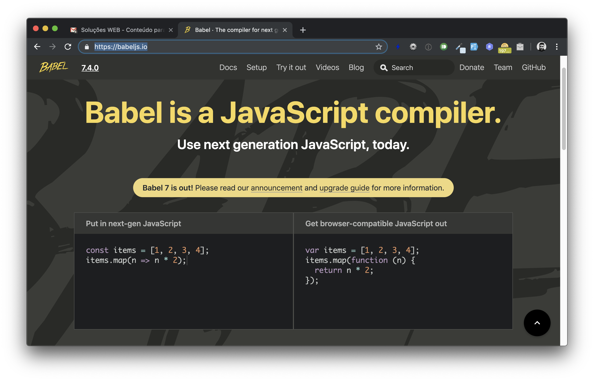

name: capa

.capa-titulo[

# Soluções WEB

]

.capa-subtitulo[

### Prof. Lucas Ferreira

]

---

class: center, middle
count: false

# Introdução ao Node.js + NPM e ferramentas de desenvolvimento

---

## Introdução ao Node.js

- Criado por Ryan Dahl em 2009

--

- Baseado na engine V8, desenvolvida pela Google e usada no Google Chrome

--

- O Node.js se preocupa em ofertar um ambiente de execução

--

- Enquanto que a engine V8 se preocupa com a interpretação do código JavaScript

--

- Uso recomendado para o desenvolvimento de APIs e aplicações de tempo-real

--

- Caracterizado por sua arquitetura baseada em eventos (Event-Loop), bem como ao I/O não bloqueante que tem foco em tarefas assíncronas

--

- Node.js trabalha por meio de single-thread (o que pode ser um problema)

---

## Principais benefícios

- Linux, Mac e Windows

--

- Abordagem orientada a eventos

--

- Melhor preparado para trabalhar com interações de tempo real

--

- Destaque: SockJS, Socket.IO e Engine.IO

--

- Muita contribuição open-source

--

- Gerenciador de Pacotes oficial: NPM

--

- Acompanha a evolução do ECMAScript

---

## Instalação do Node.js

Acesse o site oficial <https://nodejs.org> e siga o guia!

_PS.: Instale sempre uma versão estável e LTS_

---

## Hello World

Presume-se que após instalado seu executável do Node.js esteja disponível no **PATH** de seu sistema operacional. Abra seu Termina/Prompt e digite:

```console
node
```

--

Neste momento você estará com o console interativo do Node.js aberto 🤘

---

## Hello World

Crie um arquivo chamado `hello.js` e insera o seguinte código:

```js
console.log("Hello World");
```

--

Logo após volte ao seu terminal/prompt e execute seu arquivo recém criado:

```console
node hello.js
```

---

## API Nativa

A API nativa de módulos do Node.js é muito extensa e poderosa, temos diversos módulos a disposição para criarmos recursos poderosos com o runtime.

Alguns destes módulos: _http, console, fs, net, path, os, process, stream, url_ e etc

---

## HelloWorld.txt

Utilizando o módulo `fs` é possível criar, manipular e excluir arquivos físicos do sistema, conforme o exemplo abaixo:

```js
const fs = require("fs");

fs.writeFile("HelloWorld.txt", "Hello World ;)", err => {
  if (err) throw err;
  console.log("o arquivo foi salvo com sucesso");
});
```

---

## Hello World no Navegador

Utilizando o módulo `http` é possível criarmos um pequeno servidor web que responderá a solicitações http direto de seu navegador:

```js
const http = require("http");

const port = 5000;

const server = http.createServer((req, res) => {
  res.statusCode = 200;
  res.setHeader("Content-Type", "text/plain");
  res.end("Hello World de novo!\n");
});

server.listen(port, () => {
  console.log(`Server running at http://localhost:${port}/`);
});
```

---

## Gerenciamento de pacotes com NPM

- NPM é um gerenciador de pacotes para código JavaScript

--

- Focado na reutilização de código compartilhado, onde pequenos pacotes são criados para solucionar problemas específicos

--

- É possível instalar um pacote de forma global (para toda a máquina):<br />`npm install -g express`

--

- Ou instalar um pacote de forma local (apenas para o projeto atual):<br />`npm install express`

--

- Gerenciamento de pacotes locais ocorre por meio do arquivo `package.json`

--

- Todos os pacotes públicos encontram-se em <https://www.npmjs.com>

---

## Hello World no Navegador _(mais esperto)_

Neste exemplo iremos instalar um pacote chamado `express`, definido como _"um framework para aplicativo da web do Node.js mínimo e flexível que fornece um conjunto robusto de recursos para aplicativos web e móvel"_.

```js
const express = require("express");
const app = express();
const port = 5000;

app.get("/", function (req, res) {
  res.send("Hello World!");
});

app.get("/teste", function (req, res) {
  res.send("Teste");
});

app.listen(port, function () {
  console.log(`Server running at http://localhost:${port}/`);
});
```

---

## Pacotes interessantes

| Pacote     | Descrição                                                                 |
| ---------- | ------------------------------------------------------------------------- |
| standardjs | Guia de estilo JavaScript, com analisador e fixador de código automático. |
| dotenv     | Pacote para carregar variáveis de ambiente.                               |
| socket.io  | Framework para criação de aplicações de tempo real.                       |
| swagger    | Pacote composto por ferramentas para projetar e criar APIs.               |
| express    | Framework minimalista para desenvolvimento de aplicações web.             |
| helmet     | Pacote de apoio para proteção de aplicações web.                          |
| sequelize  | ORM para Node.js (Banco de dados relacionais).                            |
| mongoose   | ODM para Node.js (MongoDB).                                               |
| winston    | Pacote para armazenar log assíncrono.                                     |
| morgan     | Pacote para armazenar log de requisição HTTP.                             |
| supertest  | Pacote para teste em alto nível de requisições HTTP.                      |
| mocha      | Pacote para teste unitário.                                               |

---

class: center, middle

# LET'S DANCE 🕺

.center[.gif-img[]]

---

class: center, middle
count: false

# Ferramentas de Desenvolvimento

---

## Babel.js

Você 🙋‍♂️ desenvolvedor moderno e antenado que entende que o desenvolvimento JavaScript ágil deve usar os últimos recursos da linguagem, sabe que algumas situações _(ou projetos)_ o suporte a navegadores antigo pode ser importante?

--

Por exemplo as arrows functions (`() => { /* código */ }`) até a versão 45 do Google Chrome não era suportada mesmo estando na especificação. E se você estiver desenvolvendo um projeto que precisa rodar no Internet Explorer ou em versões mais antigas do Chrome/Firefox?

--

**Bom** é aí que entra o **Babel.js** (<https://babeljs.io/>), um "compilador" de JavaScript que interpreta o seu código "moderno" e "compila/transforma" este mesmo código em uma versão mais "antiquada" com suporte a diversos navegadores antigos.

---

## Babel.js

Por exemplo, o Babel.js pega o código abaixo:

```js
const items = [1, 2, 3, 4];
items.map(n => n ** 2);
```

--

E cria uma versão compatível com qualquer navegador (antigo ou novo):

```js
var items = [1, 2, 3, 4];
items.map(function (n) {
  return Math.pow(n, 2);
});
```

---

name: babel-demo

## Babel.js

Para uma pequena demonstração acessem o site <https://babeljs.io/>:

.center[.babel-img[]]

---

## Como usar o Babel.js

O primeiro passo é instalar os pacotes do Babel.js em seu projeto _(através do NPM)_:

```console
npm install --save-dev @babel/core @babel/cli @babel/preset-env
npm install --save @babel/polyfill
```

--

Depois disso crie um arquivo de configuração na raiz de seu projeto chamado `babel.config.js`:

```js
const presets = [
  [
    "@babel/env",
    {
      targets: {
        edge: "17",
        firefox: "60",
        chrome: "67",
        safari: "11.1",
      },
      useBuiltIns: "usage",
    },
  ],
];

module.exports = { presets };
```

---

## Como usar o Babel.js

Após instalado e configurado, tudo que precisamos fazer é informar nosso arquivo JavaScript com código de desenvolvimento (moderno) ao cliente de comando do Babel.js:

```console
./node_modules/.bin/babel src/index.js --out-dir lib
```

--

No exemplo acima apesar de codarmos no arquivo `src/index.js` iremos carregar em nosso site o produto final `lib/index.js`.

---

## Webpack

Agora a brincadeira está ficando mais **séria**. Imagine que seu projeto cresceu, você agora possui muitos arquivos JavaScript e está complicado de organizar tudo isso em um único fluxo de carregamento na parte de front-end.

--

Você também deseja agilizar o Babel.js para que ele funcione em vários arquivos ao mesmo tempo e de forma mais automatizada possível.

--

Te apresento o _"module bundler"_ **Webpack** (<https://webpack.js.org/>), uma das ferramentas de desenvolvimento front-end mais versáteis do mercado.

---

## Webpack

Como exemplo, imagine o seguinte cenário de aplicação em que subdividimos nossos componentes JS em vários módulos:

```js
// arquivo moduloA.js
export default () => {
  return "Função Módulo A";
};
```

```js
// arquivo moduloB.js
export default () => {
  return "Função Módulo B";
};
```

E por fim o seu arquivo principal:

```js
// arquivo index.js
import moduloA from "./moduloA";
import moduloB from "./moduloB";

function usaModulos() {
  console.log(moduloA());
  console.log(moduloB());
}
```

---

## Webpack

Com o Webpack devidamente configurados podemos obter um produto final compatível com diversos navegadores e que também unifique diversos arquivos/módulos/componentes JS em um único arquivo.

--

**Simulação de resultado do Webpack:**

```js
function moduloA() {
  return "Função Módulo A";
}

function moduloB() {
  return "Função Módulo B";
}

function usaModulos() {
  console.log(moduloA());
  console.log(moduloB());
}
```

---

## Como usar o Webpack

O primeiro passo é instalar os pacotes do Webpack em seu projeto _(através do NPM)_:

```console
npm install webpack webpack-cli --save-dev
```

--

Depois crie um arquivo de configuração na raiz de seu projeto chamado `webpack.config.js`:

```js
const path = require("path");

module.exports = {
  entry: "./src/index.js",
  output: {
    filename: "main.js",
    path: path.resolve(__dirname, "lib"),
  },
};
```

---

## Como usar o Webpack

Dada a condiguração anterior uma vez seu projeto esteja configurado desta forma

```console
minhaApp/
  src/
    moduloA.js
    moduloB.js
    index.js
  lib/
```

--

Sempre que executarmos o seguinte comando:

```console
./node_modules/.bin/webpack --config webpack.config.js
```

Teremos um novo arquivo gerado `lib/main.js` contendo todo o JavaScript que nosso projeto precisa para funcionar.

---

## Watch Mode do Webpack

Para elevarmos o nível de nosso desenvolvimento podemos usar o "Watch Mode" para monitorar nossos arquivos JS e sempre que algo for alterado na pasta "`src/`" o Webpack seja avisado e re-processe os arquivos:

```console
./node_modules/.bin/webpack --watch --config webpack.config.js
```

---

## Babel.js + Webpack

Por padrão o Webpack não faz sozinho que o Babel.js faz (e vice-e-versa), logo a forma mais bacana de juntar os dois é usando o `babel-loader`.

O Webpack trabalha com o conceito de "loaders" para extender suas funcionalidades e no caso do Babel.js precisamos instalar os seguintes pacotes em nosso projeto:

```console
npm install --save-dev babel-loader @babel/core @babel/preset-env
```

--

Uma vez instalado basta adicionarmos este loader nas configurações do Webpack:

```js
module: {
  rules: [
    {
      test: /\.m?js$/,
      exclude: /(node_modules|bower_components)/,
      use: {
        loader: "babel-loader",
        options: {
          presets: ["@babel/preset-env"],
        },
      },
    },
  ],
}
```

---

# KEEP MOVIN' 🕺🕺

.center[.gif-img[]]

---

## Outras ferramentas bacanas

**Webpack Configurator**: https://createapp.dev

**Grunt**: https://gruntjs.com

**Gulp**: https://gulpjs.com

**Parcel**: https://parceljs.org

---

class: center, middle
count: false

# Github

---

## Github

Antes de tudo é preciso saber que Git não é GitHub _(e vice-e-versa)_.

--

**Git** é um sistema distribuído de controle de versão de código, assim com o _Subversion_ e o finado _CVS_.

--

**GitHub** é o local onde você hospeda os seus repositórios Git na web, assim como _GitLab_ e _Bitbucket_.

--

O **GitHub** iniciou suas atividades com o modelo de ser gratuíto para projetos abertos e pago para projetos privados.

--

Dado seu modelo inicial de ser gratuíto para projetos open-source, a comunidade de desenvolvedores web adotou com rapidez e garantiu o uso amplo da plataforma para diverso projetos e bibliotecas. Hoje todo projeto open-source "de respeito" possui um repositório para contribuição no GitHub.

--

**Toda a plataforma do GitHub foi adquirida pela Microsoft no ano de 2018 por `$7.5 bilhões`!**

---

## Iniciando no Github

1. Crie uma conta no GitHub 👉 https://github.com/join

2. Instale o Git para sua plataforma 👉 https://git-scm.com/downloads

3. Para quem é iniciante recomendo muito o GitHub Desktop 👉 https://desktop.github.com

4. Após estar logado no GitHub, no canto superior direito, clicando no `+` vá em **New Repository**

5. Crie seu primeiro repositório, por exemplo `hello-world`<br />
   _PS.: Sugiro marcar a caixinha `Initialize this repository with a README`_

6. Após seu repositório criado, você poderá "clonar" este repositório / projeto localmente em sua máquina, trabalhar nele e ir enviado suas contribuições, evoluções e melhorias para a plataforma on-line.

---

## Exercício / Desafio da noite 💥

1. Crie sua conta do GitHub _(para quem ainda não o fez)_

--

2. Crie um novo repositório público com nome de `atv-sw-chat`<br />
   _PS.: Sugiro marcar a caixinha `Initialize this repository with a README`_

--

3. Clone esse repositório para o seu computador, quem for iniciante use o **GitHub Desktop** ou siga a instruções deste tutorial 👉 http://devfuria.com.br/git/tutorial-para-iniciar-com-o-git-e-o-github/

--

4. Adicione ao menos um arquivo nesse repositório, a ideia é vocês usarem esse repositório para nossa última atividade, aquela do chat em HTML+CSS e JavaScript. Quem já fez a atividade pode por os arquivos do que já está pronto. Quem não fez 😞 podem commitar no projeto aquele _modelo_chat.html_ que eu demonstrei para vocês.

--

5. Me mandem _(até a próxima aula)_ o link público do repositório que vocês criaram, podem mandar via Teams, via e-mail ou pelo whatsapp 😉

---

## Palavras-chave de hoje 🔥

**Node.JS**

**NPM**

**Babel.js**

**Webpack**

**GitHub**

**open-source**

--

<p style="text-align: center; font-size: 44px; margin-top: 51px;">🚀🚀🚀🚀🚀🚀🚀🚀🚀🚀🚀🚀🚀🚀🚀</p>
